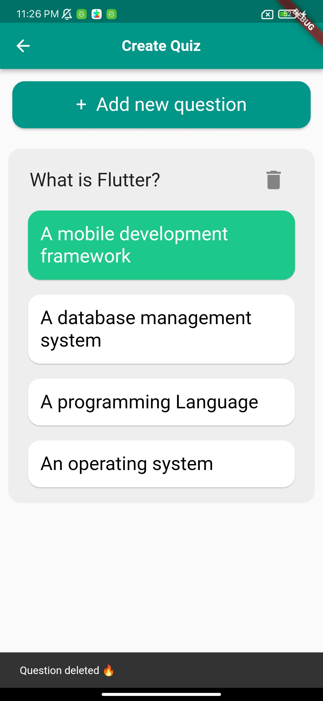

# Quiz App

## ✨ Project Description:
The Flutter Quiz App is an educational app that allows users to create and take quiz on various
topics. The app will include a home page screen with a drawer that contains the user's account
name, email, and profile picture. From the home screen, the user can navigate to the create
quiz screen, start quiz screen, and exit option.
The app will use SQLite to store user data, including quiz questions and answers.

## 🚀 Features:
1. Home Page Screen: The home page screen will contain a drawer that displays the user's
   account name, email, and profile picture. The user can navigate to the create quiz
   screen, start quiz screen, and exit option from this screen.
2. Create Quiz Screen: The create quiz screen will show list of questions and answers, allow
   users to delete any question and allow user to navigate to the add new question screen
3. Add New Question Screen: The add new question screen will allow user to input
   question and 4 options and select the correct answer
4. Start Quiz Screen: The start quiz screen will allow users to take quiz. The user will be
   presented with a series of multiple-choice questions, and the app will record the user's
   score and display it at the end of the quiz.
   You must add at least 5 questions to allow start quiz.
5. Result screen: The result screen will display at the end of the quiz to show the result of
   quiz and it contain result messages, image, score and return to home page
   Result messages and image changing according to score, there are 3 cases:
   • Score is >= 75%
   • Score >= 50%
   • Otherwise
6. SQLite Integration: The app will use SQLite to store user data, including quiz questions
   and answers.

## 📱 Screens:

  
  
  

  
  

  
  
  

  
  
  

